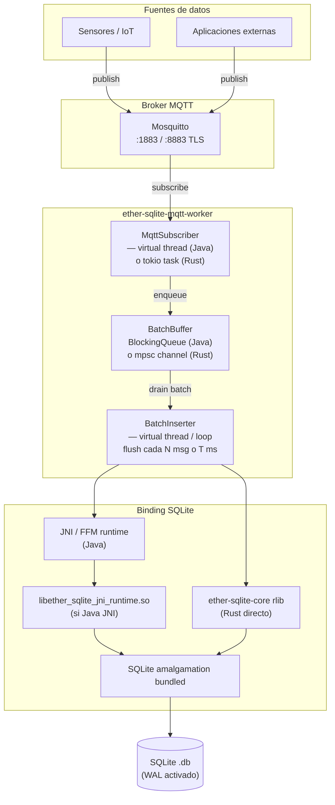
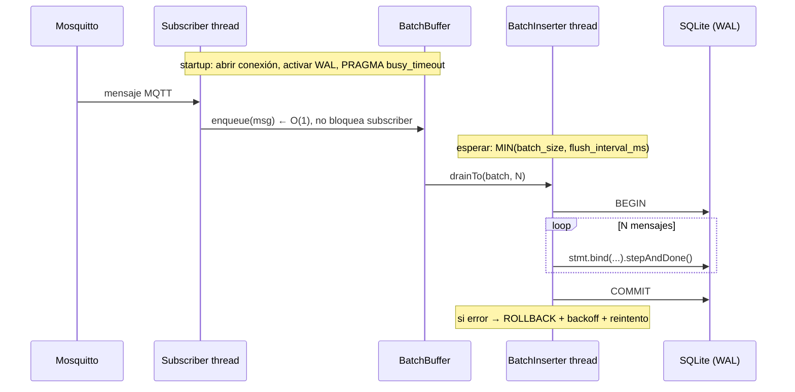
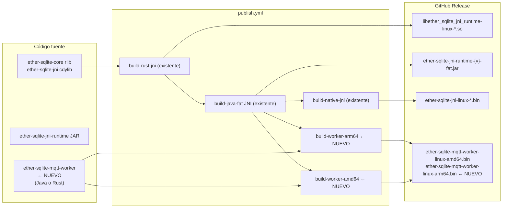
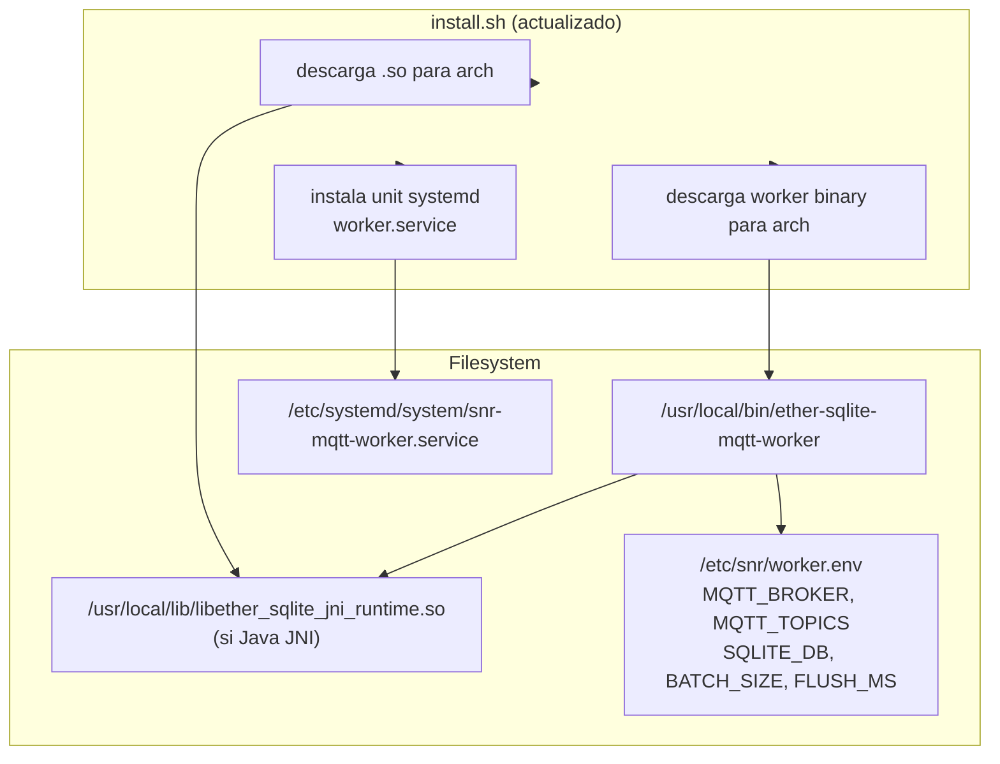

# WORKER_IDEA — MQTT → SQLite Worker

Documento de análisis y decisión para el componente de ingesta MQTT → SQLite.
Actualizado iterativamente conforme avanza la discusión técnica.

---

## La idea

Añadir un worker que suscribe a un broker Mosquitto y va insertando mensajes en SQLite de forma
gradual (batch). El objetivo es ofrecer un componente listo para despliegue en entornos edge/IoT
donde los datos llegan por MQTT y necesitan persistirse localmente.

```
MQTT (Mosquitto) → worker nativo → batch insert → SQLite WAL
```

---

## Lo que tiene sentido de la idea

La arquitectura es coherente con el stack existente. Tiene sentido si se necesita:

- Bajo consumo de recursos (RAM, CPU idle)
- Arranque rápido (edge devices, systemd restart)
- Sin JVM instalada en el servidor de destino
- Binario único distribuible
- Soporte amd64 + arm64

Y el ecosistema ya tiene todo lo necesario:

- Java 25 + GraalVM native-image (pipeline existente)
- JNI runtime (ether-sqlite-jni-runtime)
- Rust core con SQLite bundled
- Pipeline multi-arch (ubuntu-latest + ubuntu-24.04-arm)
- install.sh que resuelve arquitectura + paths

Añadir el worker **no rompe el modelo**; es una extensión natural de lo que ya existe.

---

## El challenge: matizaciones importantes

### El cuello de botella no es la JVM

Para un worker MQTT → SQLite, el throughput está limitado por:

```
I/O MQTT (red + deserialización)
serialización del payload (JSON parsing)
batching (acumulación antes del commit)
fsync / SQLite commit
WAL checkpoint
latencia del disco
```

Un JAR Java 21/25 con las técnicas correctas puede ser perfectamente viable:

```
batch inserts (drainTo N mensajes)
WAL activado
prepared statements reutilizados
una sola writer thread (o virtual thread)
evitar commit por mensaje
```

**El argumento de native-image es más fuerte por distribución y footprint que por throughput.**
No es que el JAR no funcione — es que un binario nativo es más limpio de distribuir.

### Riesgo principal: no es "un binario único"

Con el modelo Java JNI + native-image, el despliegue tiene dos piezas:

```
/usr/local/bin/ether-sqlite-mqtt-worker   ← binario GraalVM
/usr/local/lib/libether_sqlite_jni_runtime.so  ← .so externa
```

Esto es viable pero hay complejidad operativa real:

- Arquitectura correcta para cada pieza
- `LD_LIBRARY_PATH` o ruta configurada
- Permisos y propiedad de archivos
- Actualizaciones coordinadas (versión worker ↔ versión .so)
- Rollback de ambas piezas
- Unidad systemd que resuelva todo esto

`install.sh` puede resolver buena parte, pero es trabajo real.

---

## Las cuatro alternativas reales

### Opción A — Java 25 + FFM + native-image

```
Worker: Java 25
Binding: Panama FFM estable (JEP 454)
Distribución: native-image GraalVM 25
Dependencia runtime: libether_sqlite_ffm_runtime.so
JVM mínima: no necesaria
```

Pros: más moderno, sin JNI, alineado con Java 25 FFM estable.
Contras: baseline Java 25 para native-image (GraalVM 25 disponible).

### Opción B — Java 21 + JNI + native-image

```
Worker: Java 21
Binding: JNI clásico
Distribución: native-image GraalVM 25 (compila bytecode 21)
Dependencia runtime: libether_sqlite_jni_runtime.so
JVM mínima: no necesaria
```

Pros: LTS Java 21, native-image sin `--enable-preview`, mismo runner CI ya existente.
Contras: .so externa, dos piezas en despliegue.

### Opción C — Worker en Rust

```
Worker: Rust (rumqttc + ether-sqlite-core)
Binding: directo sobre ether-sqlite-core rlib
Distribución: binario estático único
Dependencia runtime: ninguna (.so embebida vía feature "bundled")
JVM mínima: no necesaria
```

Pros:
- Binario único — SQLite bundled dentro del binario
- Sin .so externa, sin JNI, sin GraalVM
- Footprint mínimo (~5-10 MB, ~4-8 MB RAM)
- Acceso directo a `ether-sqlite-core` (crate ya en workspace)
- `rumqttc` + `tokio` = ecosystem MQTT maduro en Rust

Contras:
- Añade código de *aplicación* al workspace Rust actual (que es solo librerías)
- Requiere crate nuevo `ether-sqlite-mqtt-worker` en el workspace
- Menos mantenible por desarrolladores Java que no conocen Rust
- Si necesita lógica de dominio compleja, Rust es más verboso que Java

**Esta es la competencia más fuerte para footprint y simplicidad de despliegue.**

### Opción D — Worker Java JAR (sin native-image)

```
Worker: Java 21/25
Binding: JNI o FFM
Distribución: fat JAR
Dependencia runtime: JVM + .so
```

Pros: más simple para iterar, más fácil de debuggear, logs estructurados.
Contras: requiere JVM instalada, más RAM base, arranque más lento.

Útil como **implementación de referencia** antes de compilar con native-image.

---

## Análisis de la frase original

> "Sin native-image el worker sería solo un JAR con overhead de JVM en el crítico path de ingesta
> — no tiene sentido."

La corrección correcta es:

> **El worker con native-image tiene sentido por distribución, arranque y footprint;
> no necesariamente porque un JAR sea inviable en el path de ingesta.**

Un JAR con batch inserts + WAL + prepared statements puede ingestar 50k-200k mensajes/segundo
en hardware moderno. El JVM overhead real en este escenario es ~50-100 MB de RAM base y
~300 ms de startup — no latencia de inserción.

---

## Arquitectura de sistema (runtime)



---

## Flujo interno (tiempo de respuesta crítico)



---

## Integración en el pipeline CI/CD



---

## Despliegue en producción



---

## Decisión: cómo elegir entre las opciones

Antes de implementar, ejecutar un spike comparativo con datos reales.

### Criterios de decisión

| Criterio | Peso | Java JAR | Java native | Rust |
|---|---|---|---|---|
| Throughput (msg/s) | alto | comparable | comparable | comparable |
| RAM en steady state | medio | +50-100 MB JVM | ~20-30 MB | ~4-8 MB |
| Startup time | bajo/medio | 200-500 ms | 10-30 ms | <10 ms |
| Binary size | bajo | JAR + JVM | ~20-40 MB | ~5-10 MB |
| Piezas en despliegue | alto | JVM + .so + JAR | binario + .so | binario único |
| Mantenibilidad Java devs | alto | excelente | excelente | bajo |
| Lógica de dominio Java | alto | excelente | excelente | bajo |
| SQLite bundled único | alto | no | no | sí |

### Regla de decisión

```
¿El worker necesita lógica de dominio Java reutilizable con otros módulos del proyecto?
  SÍ → Java 25 native-image (Opción A)

¿El requisito principal es distribución edge sin JVM y binario único?
  SÍ → Rust (Opción C)

¿Java 21 LTS es el target y se necesita native-image?
  SÍ → Java 21 JNI native-image (Opción B)

¿Se quiere iterar rápido y medir primero?
  → Java JAR (Opción D) como spike, luego native-image si se justifica
```

---

## Estado actual

- [ ] Spike comparativo (JAR vs native-image vs Rust)
- [ ] Decisión de implementación basada en datos
- [ ] Implementación del módulo elegido
- [ ] Pipeline CI (amd64 + arm64)
- [ ] Release integration
- [ ] Operaciones (systemd, logging, config)

Ver [PLAN_WORKER.md](PLAN_WORKER.md) para el plan de ejecución fase por fase.
