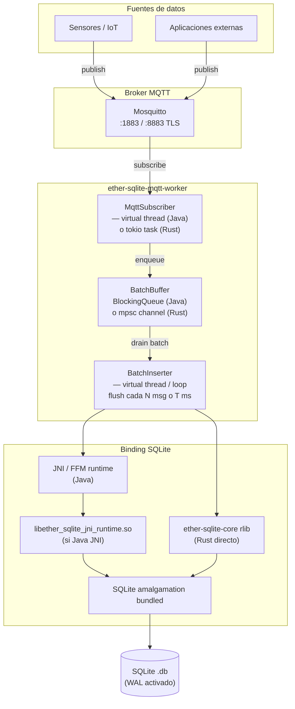
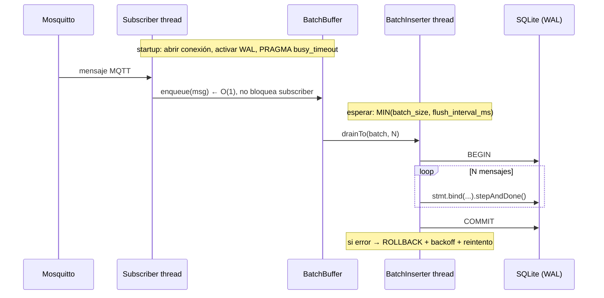
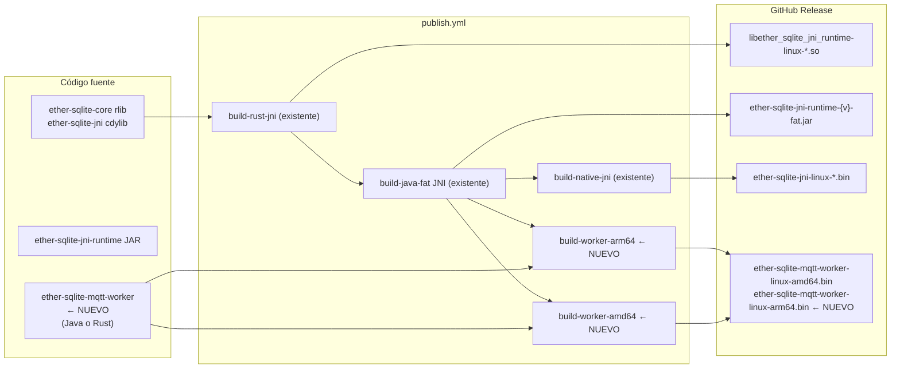
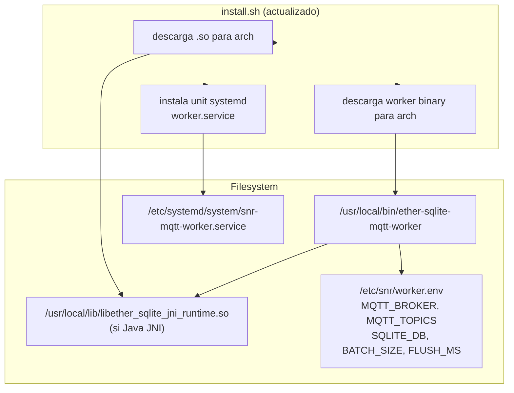

# WORKER_IDEA — MQTT → SQLite Worker

Documento de análisis y decisión para el componente de ingesta MQTT → SQLite.
Actualizado iterativamente conforme avanza la discusión técnica.

---

## La idea

Añadir un worker que suscribe a un broker Mosquitto y va insertando mensajes en SQLite de forma
gradual (batch). El objetivo es ofrecer un componente listo para despliegue en entornos edge/IoT
donde los datos llegan por MQTT y necesitan persistirse localmente.

```
MQTT (Mosquitto) → worker nativo → batch insert → SQLite WAL
```

---

## Lo que tiene sentido de la idea

La arquitectura es coherente con el stack existente. Tiene sentido si se necesita:

- Bajo consumo de recursos (RAM, CPU idle)
- Arranque rápido (edge devices, systemd restart)
- Sin JVM instalada en el servidor de destino
- Binario único distribuible
- Soporte amd64 + arm64

Y el ecosistema ya tiene todo lo necesario:

- Java 25 + GraalVM native-image (pipeline existente)
- JNI runtime (ether-sqlite-jni-runtime)
- Rust core con SQLite bundled
- Pipeline multi-arch (ubuntu-latest + ubuntu-24.04-arm)
- install.sh que resuelve arquitectura + paths

Añadir el worker **no rompe el modelo**; es una extensión natural de lo que ya existe.

---

## El challenge: matizaciones importantes

### El cuello de botella no es la JVM

Para un worker MQTT → SQLite, el throughput está limitado por:

```
I/O MQTT (red + deserialización)
serialización del payload (JSON parsing)
batching (acumulación antes del commit)
fsync / SQLite commit
WAL checkpoint
latencia del disco
```

Un JAR Java 21/25 con las técnicas correctas puede ser perfectamente viable:

```
batch inserts (drainTo N mensajes)
WAL activado
prepared statements reutilizados
una sola writer thread (o virtual thread)
evitar commit por mensaje
```

**El argumento de native-image es más fuerte por distribución y footprint que por throughput.**
No es que el JAR no funcione — es que un binario nativo es más limpio de distribuir.

### Riesgo principal: no es "un binario único"

Con el modelo Java JNI + native-image, el despliegue tiene dos piezas:

```
/usr/local/bin/ether-sqlite-mqtt-worker   ← binario GraalVM
/usr/local/lib/libether_sqlite_jni_runtime.so  ← .so externa
```

Esto es viable pero hay complejidad operativa real:

- Arquitectura correcta para cada pieza
- `LD_LIBRARY_PATH` o ruta configurada
- Permisos y propiedad de archivos
- Actualizaciones coordinadas (versión worker ↔ versión .so)
- Rollback de ambas piezas
- Unidad systemd que resuelva todo esto

`install.sh` puede resolver buena parte, pero es trabajo real.

---

## Las cuatro alternativas reales

### Opción A — Java 25 + FFM + native-image

```
Worker: Java 25
Binding: Panama FFM estable (JEP 454)
Distribución: native-image GraalVM 25
Dependencia runtime: libether_sqlite_ffm_runtime.so
JVM mínima: no necesaria
```

Pros: más moderno, sin JNI, alineado con Java 25 FFM estable.
Contras: baseline Java 25 para native-image (GraalVM 25 disponible).

### Opción B — Java 21 + JNI + native-image

```
Worker: Java 21
Binding: JNI clásico
Distribución: native-image GraalVM 25 (compila bytecode 21)
Dependencia runtime: libether_sqlite_jni_runtime.so
JVM mínima: no necesaria
```

Pros: LTS Java 21, native-image sin `--enable-preview`, mismo runner CI ya existente.
Contras: .so externa, dos piezas en despliegue.

### Opción C — Worker en Rust

```
Worker: Rust (rumqttc + ether-sqlite-core)
Binding: directo sobre ether-sqlite-core rlib
Distribución: binario estático único
Dependencia runtime: ninguna (.so embebida vía feature "bundled")
JVM mínima: no necesaria
```

Pros:
- Binario único — SQLite bundled dentro del binario
- Sin .so externa, sin JNI, sin GraalVM
- Footprint mínimo (~5-10 MB, ~4-8 MB RAM)
- Acceso directo a `ether-sqlite-core` (crate ya en workspace)
- `rumqttc` + `tokio` = ecosystem MQTT maduro en Rust

Contras:
- Añade código de *aplicación* al workspace Rust actual (que es solo librerías)
- Requiere crate nuevo `ether-sqlite-mqtt-worker` en el workspace
- Menos mantenible por desarrolladores Java que no conocen Rust
- Si necesita lógica de dominio compleja, Rust es más verboso que Java

**Esta es la competencia más fuerte para footprint y simplicidad de despliegue.**

### Opción D — Worker Java JAR (sin native-image)

```
Worker: Java 21/25
Binding: JNI o FFM
Distribución: fat JAR
Dependencia runtime: JVM + .so
```

Pros: más simple para iterar, más fácil de debuggear, logs estructurados.
Contras: requiere JVM instalada, más RAM base, arranque más lento.

Útil como **implementación de referencia** antes de compilar con native-image.

---

## Análisis de la frase original

> "Sin native-image el worker sería solo un JAR con overhead de JVM en el crítico path de ingesta
> — no tiene sentido."

La corrección correcta es:

> **El worker con native-image tiene sentido por distribución, arranque y footprint;
> no necesariamente porque un JAR sea inviable en el path de ingesta.**

Un JAR con batch inserts + WAL + prepared statements puede ingestar 50k-200k mensajes/segundo
en hardware moderno. El JVM overhead real en este escenario es ~50-100 MB de RAM base y
~300 ms de startup — no latencia de inserción.

---

## Arquitectura de sistema (runtime)



---

## Flujo interno (tiempo de respuesta crítico)



---

## Integración en el pipeline CI/CD



---

## Despliegue en producción



---

## Decisión: cómo elegir entre las opciones

Antes de implementar, ejecutar un spike comparativo con datos reales.

### Criterios de decisión

| Criterio | Peso | Java JAR | Java native | Rust |
|---|---|---|---|---|
| Throughput (msg/s) | alto | comparable | comparable | comparable |
| RAM en steady state | medio | +50-100 MB JVM | ~20-30 MB | ~4-8 MB |
| Startup time | bajo/medio | 200-500 ms | 10-30 ms | <10 ms |
| Binary size | bajo | JAR + JVM | ~20-40 MB | ~5-10 MB |
| Piezas en despliegue | alto | JVM + .so + JAR | binario + .so | binario único |
| Mantenibilidad Java devs | alto | excelente | excelente | bajo |
| Lógica de dominio Java | alto | excelente | excelente | bajo |
| SQLite bundled único | alto | no | no | sí |

### Regla de decisión

```
¿El worker necesita lógica de dominio Java reutilizable con otros módulos del proyecto?
  SÍ → Java 25 native-image (Opción A)

¿El requisito principal es distribución edge sin JVM y binario único?
  SÍ → Rust (Opción C)

¿Java 21 LTS es el target y se necesita native-image?
  SÍ → Java 21 JNI native-image (Opción B)

¿Se quiere iterar rápido y medir primero?
  → Java JAR (Opción D) como spike, luego native-image si se justifica
```

---

## Diseño del protocolo MQTT — ingesta genérica

> Esta sección expande el scope del worker: ya no es un "insertador de mensajes",
> es un **gateway de ingesta asíncrona** orientado a datos. El spike de la Fase 0
> sigue siendo válido para medir throughput bruto; la implementación final incorpora
> el protocolo aquí descrito.

### Principio de diseño

Los topics **no deben acoplarse a SQLite**. Deben expresar intención de negocio:
`quién`, `qué base de datos lógica`, `qué entidad` y `qué operación`.
El worker es el encargado de traducir esa intención a SQL.

### Patrón de topic

```
db/{priority}/{tenant}/{database}/{entity}/{operation}
```

| Segmento | Valores | Descripción |
|---|---|---|
| `db` | literal | Namespace fijo — distingue topics de datos de topics de control |
| `priority` | `high` / `normal` / `low` | Cola de prioridad — el worker procesa high primero |
| `tenant` | `default`, `hotel01`, `cliente_x` | Aislamiento lógico multi-tenant |
| `database` | `telemetry`, `auth`, `portal`, `audit` | Base de datos lógica (puede mapear a un archivo SQLite distinto) |
| `entity` | `sensor_reading`, `users`, `sessions` | Tabla o colección lógica destino |
| `operation` | `insert`, `insert_batch`, `upsert`, `update`, `delete` | Tipo de operación DML |

### Operaciones del MVP

#### 1. Insert simple

```
db/{priority}/{tenant}/{database}/{entity}/insert
```

```json
{
  "id": "msg-uuid-001",
  "schema": "sensor_reading.v1",
  "timestamp": "2026-05-26T12:30:00Z",
  "data": {
    "sensor_id": "sensor-001",
    "temperature": 25.4,
    "humidity": 60
  },
  "metadata": {
    "source": "raspi3b-sensor",
    "trace_id": "trace-001"
  }
}
```

#### 2. Insert batch (el productor también puede enviar lotes)

```
db/{priority}/{tenant}/{database}/{entity}/insert_batch
```

```json
{
  "id": "batch-uuid-001",
  "schema": "sensor_reading.v1",
  "items": [
    { "id": "msg-001", "data": { "sensor_id": "sensor-001", "temperature": 25.4 } },
    { "id": "msg-002", "data": { "sensor_id": "sensor-002", "temperature": 26.1 } }
  ],
  "metadata": { "source": "gateway-001" }
}
```

> El worker ya hace batching interno de mensajes individuales. Este topic permite
> que el productor también agrupe, eliminando el overhead de N publicaciones MQTT.

#### 3. Upsert

```
db/{priority}/{tenant}/{database}/{entity}/upsert
```

```json
{
  "id": "msg-uuid-003",
  "schema": "items.v1",
  "key":  { "id": "item-001" },
  "data": { "name": "Balón", "location": "garage", "updated_at": "2026-05-26T12:30:00Z" }
}
```

Traduce a: `INSERT INTO items (...) VALUES (...) ON CONFLICT(id) DO UPDATE SET ...`

#### 4. Update parcial *(cuidado — scope acotado en MVP)*

```
db/{priority}/{tenant}/{database}/{entity}/update
```

```json
{
  "id": "msg-uuid-004",
  "where": { "id": "item-001" },
  "data":  { "location": "closet" }
}
```

> **Riesgo**: el productor controla condiciones `WHERE`. En el MVP limitar a
> clave primaria única — no soportar `WHERE` arbitrario en la primera versión.

#### 5. Delete lógico *(no físico en el MVP)*

```
db/{priority}/{tenant}/{database}/{entity}/delete
```

```json
{
  "id": "msg-uuid-005",
  "where": { "id": "item-001" }
}
```

El worker ejecuta `UPDATE ... SET deleted_at = CURRENT_TIMESTAMP WHERE id = ?`
en lugar de `DELETE`. El borrado físico queda para una operación explícita fuera de banda.

---

### Topics de suscripción para el worker

```bash
# Todo — todos los tenants, prioridades y operaciones
MQTT_TOPICS=db/+/+/+/+/insert,db/+/+/+/+/insert_batch,db/+/+/+/+/upsert

# Solo una base de datos lógica
db/+/default/telemetry/+/insert

# Solo alta prioridad
db/high/+/+/+/+

# Comodín total (para un worker "catch-all")
db/+/+/+/+/+
```

---

### Topics de control del worker

Independientes del namespace `db/`. El worker publica activamente en estos topics.

#### Health check

```
worker/{worker_id}/health
```

```json
{
  "status": "ok",
  "queue_depth": 120,
  "db_status": "ok",
  "uptime_seconds": 3600,
  "version": "0.1.0"
}
```

#### Métricas

```
worker/{worker_id}/metrics
```

```json
{
  "received":       150000,
  "committed":      149800,
  "failed":         12,
  "dropped":        5,
  "queue_depth":    300,
  "avg_batch_size": 450,
  "last_flush_ms":  27,
  "max_flush_ms":   85
}
```

#### Dead Letter Queue (DLQ)

Cuando un mensaje no se puede insertar (schema inválido, error persistente):

```
db/dlq/{tenant}/{database}/{entity}/{operation}
```

```json
{
  "original_topic": "db/normal/default/telemetry/sensor_reading/insert",
  "error":          "missing required field: sensor_id",
  "payload":        { "data": { "temperature": 25.4 } },
  "failed_at":      "2026-05-26T12:30:00Z",
  "worker_id":      "ether-sqlite-01"
}
```

#### Retry

```
db/retry/{tenant}/{database}/{entity}/{operation}
```

Misma estructura que el mensaje original. El worker reintenta con backoff exponencial.
Tras N reintentos fallidos, el mensaje va a DLQ.

---

### Tabla SQLite recomendada para el MVP

> **Decisión de diseño crítica**: no mapear dinámicamente JSON → tabla específica.
> Eso genera riesgo de SQL injection, complejidad de schema y acoplamiento.
>
> En cambio: tabla genérica de ingesta + ETL/transformación posterior.

```sql
CREATE TABLE ingest_event (
    id            TEXT    PRIMARY KEY,          -- msg-uuid del payload
    tenant        TEXT    NOT NULL,
    database_name TEXT    NOT NULL,
    entity        TEXT    NOT NULL,
    operation     TEXT    NOT NULL,             -- insert | insert_batch | upsert | update | delete
    topic         TEXT    NOT NULL,             -- topic MQTT completo (auditoría)
    priority      TEXT    NOT NULL DEFAULT 'normal',
    schema_name   TEXT,                         -- "sensor_reading.v1"
    payload       TEXT    NOT NULL,             -- JSON completo del mensaje
    metadata      TEXT,                         -- JSON del campo "metadata"
    received_at   TEXT    NOT NULL,             -- ISO 8601
    processed_at  TEXT                          -- NULL hasta que se procesa
);

CREATE INDEX idx_ingest_tenant    ON ingest_event(tenant, database_name, entity);
CREATE INDEX idx_ingest_received  ON ingest_event(received_at);
CREATE INDEX idx_ingest_priority  ON ingest_event(priority, received_at);
CREATE INDEX idx_ingest_processed ON ingest_event(processed_at) WHERE processed_at IS NULL;
```

**Flujo resultante**:

```
MQTT → worker → ingest_event (raw, rápido, sin validación compleja)
                    ↓
             procesos específicos / vistas / ETL / triggers
                    ↓
             tablas de dominio (sensor_reading, users, sessions, ...)
```

Ventajas de este modelo:
- El worker nunca ejecuta SQL dinámico arbitrario → cero riesgo de injection
- Alta throughput: siempre el mismo `INSERT INTO ingest_event` preparado
- Auditoria completa: todos los mensajes quedan registrados con su topic original
- El ETL es separable, versionable e independiente del worker

---

### Arquitectura de colas con prioridad

El worker mantiene **tres colas internas** según prioridad:

```
MQTT subscriber
  ├── topic db/high/...   → PriorityQueue HIGH  (buffer pequeño, flush rápido)
  ├── topic db/normal/... → PriorityQueue NORMAL (buffer estándar)
  └── topic db/low/...   → PriorityQueue LOW    (flush diferido)

BatchInserter (un thread por prioridad o round-robin ponderado)
  HIGH:   flush cada 50ms  o 100 msgs
  NORMAL: flush cada 200ms o 500 msgs
  LOW:    flush cada 1000ms o 2000 msgs
```

Esto impacta la complejidad de implementación:
- Java: tres `BlockingQueue` + lógica de scheduling
- Rust: tres `SyncChannel` + tres threads o selección tokio

> **Para el MVP**: empezar con una sola cola sin prioridad. Añadir prioridad en v0.2
> cuando el spike confirme que el throughput base es aceptable.

---

### Implicaciones sobre el spike (Fase 0)

El spike actual mide throughput bruto con `mqtt_messages` tabla plana.
Ese resultado sigue siendo válido porque:

1. **El cuello de botella es el batch INSERT + COMMIT**, no el routing del topic
2. La tabla `ingest_event` tiene el mismo perfil de escritura que `mqtt_messages`
3. Añadir el parser de topics (split por `/`) es O(1) por mensaje — despreciable

Lo que el spike **no** mide y habrá que medir en Fase 2:
- Overhead del JSON parsing del payload (para extraer `data`, `metadata`, `schema`)
- Overhead de la lógica de deduplicación por `id` (PRIMARY KEY TEXT = hash lookup)
- Comportamiento con tres colas y prioridades distintas

---

### Topics MVP recomendados

```bash
# Suscripción del worker (3 operaciones × comodines)
MQTT_TOPICS=db/+/+/+/+/insert,db/+/+/+/+/insert_batch,db/+/+/+/+/upsert

# Ejemplos de producción
db/normal/default/telemetry/sensor_reading/insert
db/normal/default/telemetry/sensor_reading/insert_batch
db/high/default/audit/security_event/insert
db/normal/hotel01/portal/session/upsert
db/low/default/metrics/page_view/insert

# DLQ y control
db/dlq/default/telemetry/sensor_reading/insert
worker/ether-sqlite-01/health
worker/ether-sqlite-01/metrics
```

---

## Estado actual

- [x] Análisis de tecnología (JAR vs native-image vs Rust)
- [x] Diseño del protocolo MQTT (topics + payload contract + tabla `ingest_event`)
- [ ] Spike comparativo Fase 0 (JAR vs native-image vs Rust) — **en progreso**
- [ ] Decisión de implementación basada en datos del spike
- [ ] Implementación del módulo elegido (con protocolo de topics completo)
- [ ] Pipeline CI (amd64 + arm64)
- [ ] Release integration
- [ ] Operaciones (systemd, DLQ, health endpoint, prioridades)

Ver [PLAN_WORKER.md](PLAN_WORKER.md) para el plan de ejecución fase por fase.
